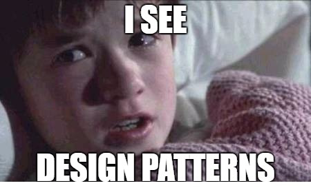

title: Design Patterns
class: animation-fade
layout: true

.bottom-bar[

{{title}}

]

---

class: impact

# {{title}}

## Un catálogo nada exhaustivo

> "Orienta tu código para un uso futuro,

> no solo para las necesidades inmediatas."
>
> -- **Eric Freeman**

---

[Arquitectura de software] (https://medium.com/@albertobasalo71/la-arquitectura-del-software-y-el-tiempo-dc7f55c23bce)

Evoluciona en función del tiempo de mantenimiento esperado.

---

## Principios para un final feliz

###  POLA: Principle Of Least Astonishment.

- No me sorprendas, no me hagas pensar.

###  YAGNI: You aren't gonna need it.

- Implementa cosas cuando las necesites, no cuando preveas que las necesitas.

### HP: Hollywood principle.

- No nos llames, ya te llamaremos. Inversión del control.

### TDA: Tell don’t ask.

- Decirle a los objetos lo que quieres que hagan (método con datos propios), no consultarles para actuar con sus datos después.

---

### CQS: Command–query separation.

- Cada método debe ser o un comando que realice una acción o una consulta que devuelva datos; **pero no ambos**.

### CoC: Convention over configuration.

- Establecer y cumplir convenios que minimicen la cantidad de decisiones necesarias.

### La Ley de Demeter (LoD)

- Un objeto debe asumir lo menos posible acerca de cualquier otro. _Antiglobalización!_.

### Composite reuse principle

- Mejor componer que heredar.

---

## Un catálogo nada exhaustivo

- Tipos: creacionales, estructurales y de comportamiento
- Revisión de los más utilizados

---

- [<- Vuelta al índice ](./)

- [Repo](https://github.com/AcademiaBinaria/clean-software-architecture)
