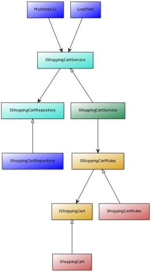

title: Onion Architecture
class: animation-fade
layout: true

.bottom-bar[

{{title}}

]

---

class: impact

# {{title}}

## Arquitectura en capas

---

# Arquitecturas para construir software de tamaño extra grande.

> Entre **8 y 16 años** de tiempo de desarrollo y mantenimiento evolutivo activo.
>
> Equipos variables de **16 o más integrantes**.

**Ejemplos**:

- Software de gestión de grandes corporaciones, bancos y administraciones públicas.
- Continuidad de productos o servicios online de gran éxito.

---

## Situación:

- Más allá de 8 años ya sólo una cosa será cierta; **todo habrá cambiado**.

- Además del negocio también cambiarán **las tecnologías, las personas, y las demandas y expectativas** de los usuarios.

- Así que, si algo va a durar una década, mejor que **no dependa de pequeños detalles** sin importancia como las bases de datos, las interfaces de usuario, los protocolos de comunicaciones, los frameworks o los dispositivos físicos de última generación :-).

## Objetivo:

> El **desacoplamiento extremo** entre el núcleo del negocio y los detalles técnicos. Inversión del control para que las reglas de negocio no dependan de otras capas.

---

## Reglas:

**Mantra**: _Que el negocio no dependa de la tecnología._

**Código**: Aplicar técnicas de inyección de dependencias para invertir el control.

**Test**: Garantizar que el software funciona unitariamente mediante pruebas a nivel de paquete desplegable.

**Componentes**: Reducir las dependencias de la lógica de negocio a los básicos del lenguaje.

**Despliegue**: Propiciar el despliegue de servicios (o micro-servicios) y aplicaciones (o micro-aplicaciones) al menor nivel posible. Las arquitecturas más usadas son **la hexagonal y la circular o cebolla** con las entidades del dominio y las reglas en el centro o cúspide del árbol de dependencias

---

> Junta las cosas que cambian por las mismas razones. Sepáralas de cosas que cambian por otras razones.
>
> -- **Robert C. Martin**

---

---

## Patrones de arquitectura

### The Separation of Concerns (SoC) principle
### Domain Driven Design (DDD)
### The model-view-controller (MVC) design pattern
### The Repository and the Data Mapper design patterns

---

## Arquitecturas limpias

- **Independiente de frameworks:** La arquitectura no depende de la existencia de alguna biblioteca de software. Esto permite usar las librerías como herramientas, en lugar de tener adaptar el sistemas a las especificidades del framework.

- **Testable:** Las reglas de negocio se pueden probar sin la interfaz de usuario, la base de datos, el servidor web o cualquier otro elemento externo.

- **Independiente de la interfaz de usuario:** La interfaz de usuario puede cambiar fácilmente, sin cambiar el resto del sistema. Una interfaz de usuario web podría reemplazarse con una interfaz de usuario de consola, por ejemplo, sin cambiar las reglas de negocios.

- **Independiente de la base de datos:** Puede intercambiar Oracle o SQL Server, por Mongo, BigTable, CouchDB, o cualquier otra cosa. Las reglas de negocio no están vinculadas a la base de datos.

- **Independiente de cualquier agente externa:** De hecho, las reglas de negocio simplemente no saben nada sobre el mundo exterior.

---

> ... si tienes miedo de cambiar algo, es porque está mal diseñado.
>
> -- **Martin Fowler**

--

> “Las prisas pasan, la mierda queda.”
>
> -- **Programador anónimo**

---

- [<- Vuelta al índice ](./)

- [Repo](https://github.com/AcademiaBinaria/clean-software-architecture)
